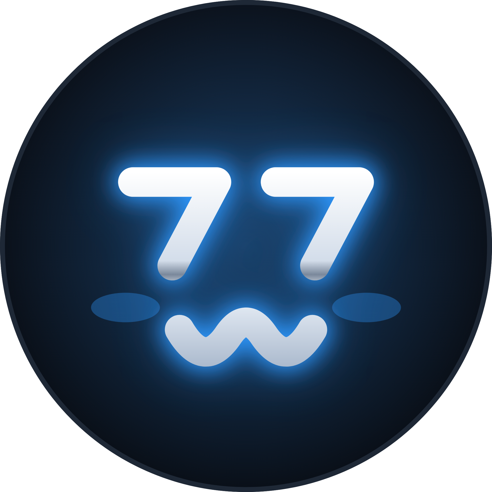
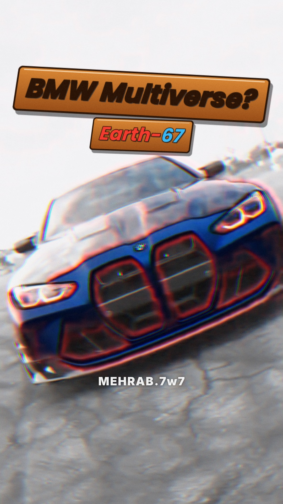
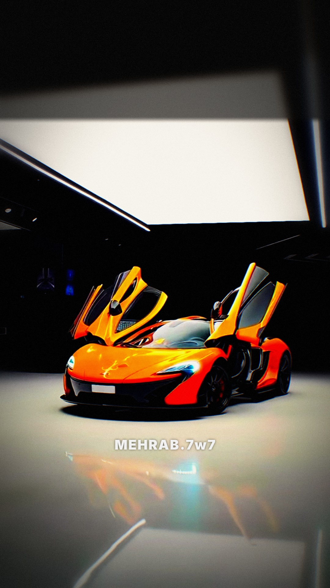
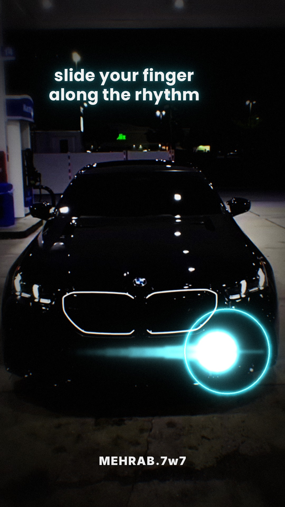
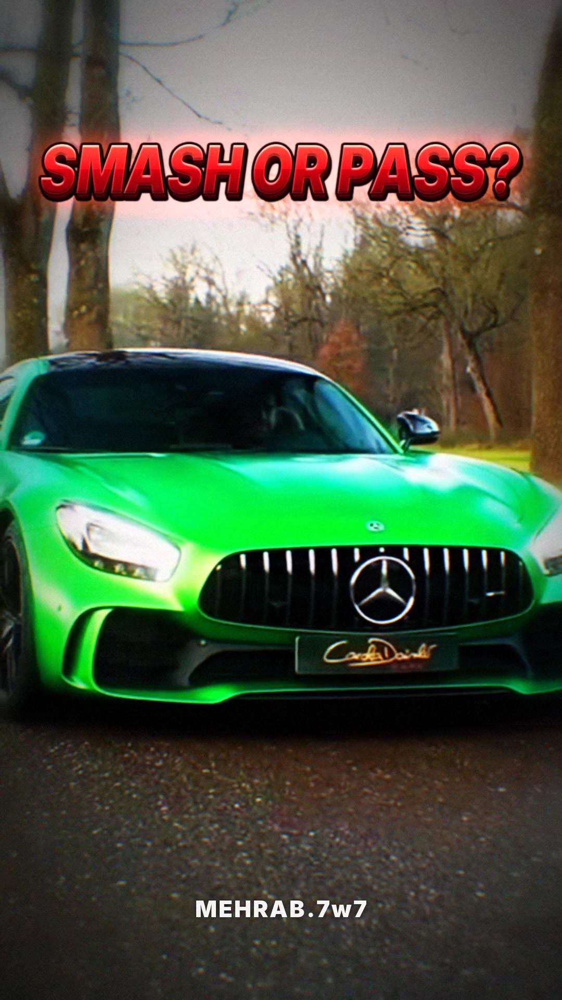
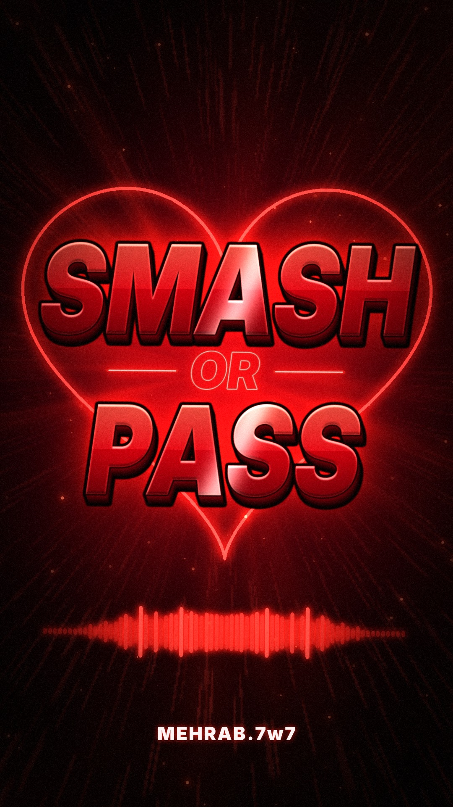
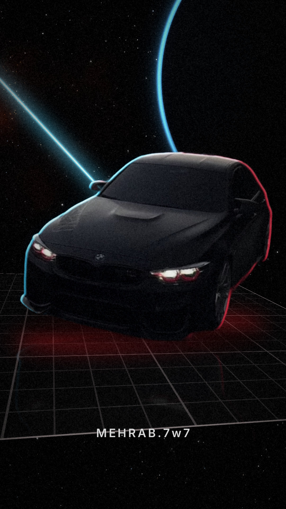
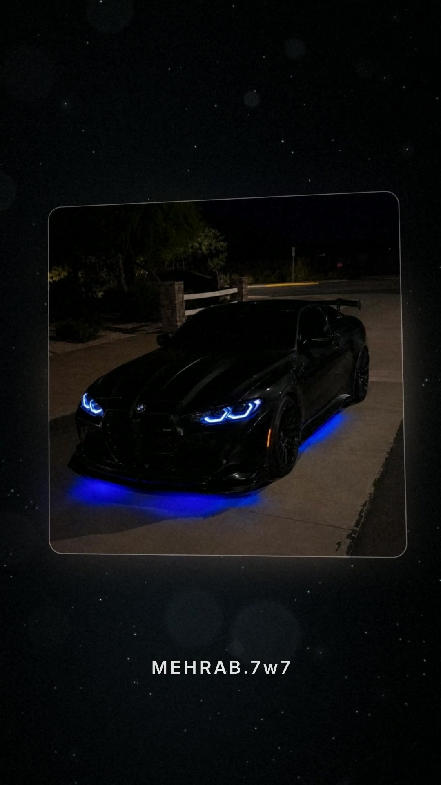

# MEHRAB.7w7 — Car Edits

**📝 متن شروع چت جدید:** [`CHAT_START.txt`](CHAT_START.txt) · [دانلود مستقیم](https://github.com/Mehrabshahidi7777/Supra/raw/main/CHAT_START.txt) — اولِ هر چت جدید اینو بده تا بدونه چنل، روش ادیت، برنامه‌ی ۳۰ شبه و شب فعلی چیه.

**🧰 جعبه‌ابزار ادیت:** [`edit_toolkit`](edit_toolkit/README.md) — همه‌ی اسکریپت‌ها، افکت‌ها، روش کار و ایده‌ها یه‌جا، برای ساختن ادیت‌های بعدی توی هر چت جدید.

## 🖤 لوگوی MEHRAB.7w7 (صورتک 7w7)

دو تا 7 چشم‌های زیرچشمی و w لبخند شیطونی — نئون آبی و کرومی.

| فایل | توضیح |
|---|---|
| [`MEHRAB7w7_profile_square.png`](MEHRAB7w7_Logo/MEHRAB7w7_profile_square.png) | برای عکس پروفایل یوتیوب، اینستاگرام و فیس‌بوک (2048×2048) — خود اپ دایره‌ش می‌کنه |
| [`MEHRAB7w7_logo_circle.png`](MEHRAB7w7_Logo/MEHRAB7w7_logo_circle.png) | لوگوی دایره‌ای با گوشه‌های شفاف (2048×2048) |
| [`MEHRAB7w7_logo_transparent.png`](MEHRAB7w7_Logo/MEHRAB7w7_logo_transparent.png) | فقط خود صورتک بدون پس‌زمینه — برای واترمارک و روی ویدیو |
| [`MEHRAB7w7_YouTube_banner_2560x1440.png`](MEHRAB7w7_Logo/MEHRAB7w7_YouTube_banner_2560x1440.png) | بنر (Banner image) کانال یوتیوب — 2560×1440، لوگو و اسم توی محدوده‌ی امن 1546×423 |
| [`MEHRAB7w7_Facebook_cover_1640x624.png`](MEHRAB7w7_Logo/MEHRAB7w7_Facebook_cover_1640x624.png) | کاور (Cover photo) فیس‌بوک — 1640×624، محتوا وسطه که توی گوشی هم بریده نشه |
| [`MEHRAB7w7_logo_circle.svg`](MEHRAB7w7_Logo/MEHRAB7w7_logo_circle.svg) | نسخه‌ی وکتور (هر سایزی بدون افت کیفیت) |

**⬇️ دانلود مستقیم:** [پروفایل](https://github.com/Mehrabshahidi7777/Supra/raw/main/MEHRAB7w7_Logo/MEHRAB7w7_profile_square.png) · [دایره‌ای](https://github.com/Mehrabshahidi7777/Supra/raw/main/MEHRAB7w7_Logo/MEHRAB7w7_logo_circle.png) · [بدون پس‌زمینه](https://github.com/Mehrabshahidi7777/Supra/raw/main/MEHRAB7w7_Logo/MEHRAB7w7_logo_transparent.png) · [بنر یوتیوب](https://github.com/Mehrabshahidi7777/Supra/raw/main/MEHRAB7w7_Logo/MEHRAB7w7_YouTube_banner_2560x1440.png) · [کاور فیس‌بوک](https://github.com/Mehrabshahidi7777/Supra/raw/main/MEHRAB7w7_Logo/MEHRAB7w7_Facebook_cover_1640x624.png)

---

## BMW Multiverse 🕷️🌀 Spider-Verse Car Edit — Night 6 (YouTube / Instagram / Facebook / WhatsApp)

**شب ۶ برنامه‌ی ۳۰ شبه (۱۶ مهر ۱۴۰۵) — BMW Multiverse**، به سبک الگوی اسپایدرورسی یوتیوب @miot7 با آهنگِ خود الگو. چون صحنه‌ی اسپایدرمن روی BMW پیدا نشد، دنیای خونه یه M4 مشکی توی برفِ شبه با چراغ‌های قرمز: گلیچ اسپایدرورسی و برچسب‌های «???...» و «BMW Multiverse?»، بعد زوم توی چراغ و پورتال قرمز با چهار زمین (E30 قرمز، E36 بنفش، M2 آبی، M4 مشکی)، سوراخ کاغذپاره‌ی Earth-???، دنیای سفید Earth-67 با M4 آبی و خط‌دور قرمز، ترنزیشن قلم‌موی جوهری، دوربین مداربسته‌ی سیاه‌وسفید با ماشین شبحِ فیروزه‌ای، دنیای فیروزه‌ای Earth-928 با M3 G80 و فلش M3 / G80، و آخر MEHRAB.7w7 نورانیِ لرزون؛ ویدیو از چراغ‌های قرمز دوباره شروع می‌شه و لوپ بی‌درزه. بدون فلش سفید، ذرات دون‌دونه و نوار بالا؛ پلاک‌ها پاک شدن و ویدیوهای لوگودار استفاده نشدن.

| فایل | توضیح |
|---|---|
| [`Night6_BMW_Multiverse_4K_60fps.mp4`](Night6_BMW_Multiverse/Night6_BMW_Multiverse_4K_60fps.mp4) | **نسخه‌ی انتشار** برای یوتیوب، اینستاگرام، فیسبوک و استوری واتساپ — عمودی فورکی 2160×3840، ۶۰ فریم، ۱۴.۲ ثانیه، صدا ‎-14 LUFS |
| [`Night6_BMW_Multiverse_1080p_60fps.mp4`](Night6_BMW_Multiverse/Night6_BMW_Multiverse_1080p_60fps.mp4) | همون، سبک 1080×1920 (برای فرستادن توی چت) |
| [`Night6_BMW_Multiverse_cover.jpg`](Night6_BMW_Multiverse/Night6_BMW_Multiverse_cover.jpg) | کاور (عمودی 1080×1920) |
| [`YouTube_title_description.txt`](Night6_BMW_Multiverse/YouTube_title_description.txt) | عنوان و توضیحات انگلیسی برای هر پلتفرم، متن وضعیت واتساپ و کرِدیت |

**⬇️ دانلود مستقیم (یه کلیک):** [نسخه‌ی انتشار فورکی](https://github.com/Mehrabshahidi7777/Supra/raw/main/Night6_BMW_Multiverse/Night6_BMW_Multiverse_4K_60fps.mp4) · [نسخه‌ی 1080p](https://github.com/Mehrabshahidi7777/Supra/raw/main/Night6_BMW_Multiverse/Night6_BMW_Multiverse_1080p_60fps.mp4) · [کاور](https://github.com/Mehrabshahidi7777/Supra/raw/main/Night6_BMW_Multiverse/Night6_BMW_Multiverse_cover.jpg) · [متن عنوان و توضیحات](https://github.com/Mehrabshahidi7777/Supra/raw/main/Night6_BMW_Multiverse/YouTube_title_description.txt)

---

## Porsche GT3 RS & McLaren P1 — Glass Shatter 💥🔥 — Night 5 (YouTube / Instagram / Facebook / WhatsApp)

**شب ۵ برنامه‌ی ۳۰ شبه (۱۵ مهر ۱۴۰۵) — MEHRAB.7w7 Reveal**، به سبک الگوی یوتیوب @Zs3riyx با همون آهنگ (ELA PEIDA FUNK – Slowed). **نسخه‌ی انتشار، نسخه‌ی کپ‌کات خودته:** روی ادیت من توی کپ‌کات فیلتر آبی پررنگ برای ماشین اول، افکت شیشه‌شکستن روی دراپ، نورهای سبزآبی و نارنجی، افکت منشوری روی GT3 و یه افکت سیاه که باز می‌شه گذاشتی؛ نوار تار و تیره‌ی بالای کادر (که توی فایل من بود) رو از کل ویدیو پاک کردم و افکت‌هات دست نخوردن. لوگوی کپ‌کات توی ویدیو نبود. به خواست خودت افکت سیاهی که باز می‌شه از روی شات‌های GT3 (که ۲.۵ ثانیه طول می‌کشید) برداشته شد و اومد روی اومدن اسم آخر: اول سیاهه، بعد نور مورب باز می‌شه و نصف اسم روشن می‌شه، بعد کامل باز می‌شه و MEHRAB.7w7 کامل دیده می‌شه، با یه زوم آروم و یه برق نور روی حروف که آخر ویدیو هیچ‌وقت ثابت نمونه. چون آخرش لگ داشت، نسخه‌ی انتشار ۶۰ فریم شد: فیلتر آبی اول روی فریم‌های ۶۰تایی من اعمال شده و فقط لحظه‌های افکت‌های کپ‌کاتت از خروجی خودت اومده. ساختار ادیت: ۴ ثانیه‌ی اول آروم با GT3 RS آبی، زوم توی چراغ و چرخش به نمای استودیو؛ قبل از دراپ دو تا P1 مثل برچسب میان تو و روی دراپ زوم به داخل؛ بعد روی هر ضرب یه کات با تاری حرکتی، و هر ماشین ۴ ضرب: P1 نارنجی، 911 توربو S مشکی و GT3 نقره‌ای؛ آخر ویدیو MEHRAB.7w7 کرومی تیغ‌دار و لوپ با زوم. دو ویدیویی که لوگوی سازنده داشتن استفاده نشدن و تابلوی STOP و نوشته‌ی پلاک‌ها پاک شده. نسخه‌ی خود من (بدون نوار بالا، ۶۰ فریم) هم هست، مثلاً برای اینکه توی کپ‌کات جای فایل قبلی بذاری.

| فایل | توضیح |
|---|---|
| [`Night5_MEHRAB7w7_Reveal_CapCut_4K_60fps.mp4`](Night5_MEHRAB7w7_Reveal/Night5_MEHRAB7w7_Reveal_CapCut_4K_60fps.mp4) | **نسخه‌ی انتشار** (نسخه‌ی کپ‌کات خودت، بدون نوار بالا) برای یوتیوب، اینستاگرام، فیسبوک و استوری واتساپ — عمودی فورکی 2160×3840، ۶۰ فریم، ۱۳.۷ ثانیه، صدا ‎-14 LUFS |
| [`Night5_MEHRAB7w7_Reveal_CapCut_1080p_60fps.mp4`](Night5_MEHRAB7w7_Reveal/Night5_MEHRAB7w7_Reveal_CapCut_1080p_60fps.mp4) | همون نسخه، سبک 1080×1920 (برای فرستادن توی چت) |
| [`Night5_MEHRAB7w7_Reveal_4K_60fps.mp4`](Night5_MEHRAB7w7_Reveal/Night5_MEHRAB7w7_Reveal_4K_60fps.mp4) | نسخه‌ی خود من بدون افکت‌های کپ‌کات و بدون نوار بالا — فورکی، ۶۰ فریم |
| [`Night5_MEHRAB7w7_Reveal_1080p_60fps.mp4`](Night5_MEHRAB7w7_Reveal/Night5_MEHRAB7w7_Reveal_1080p_60fps.mp4) | نسخه‌ی خود من، سبک 1080×1920، ۶۰ فریم |
| [`Night5_MEHRAB7w7_Reveal_cover.jpg`](Night5_MEHRAB7w7_Reveal/Night5_MEHRAB7w7_Reveal_cover.jpg) | کاور (عمودی 1080×1920) |
| [`YouTube_title_description.txt`](Night5_MEHRAB7w7_Reveal/YouTube_title_description.txt) | عنوان و توضیحات انگلیسی برای هر پلتفرم، به‌اضافه‌ی کرِدیت آهنگ و کلیپ‌ها |

**⬇️ دانلود مستقیم (یه کلیک):** [نسخه‌ی انتشار فورکی](https://github.com/Mehrabshahidi7777/Supra/raw/main/Night5_MEHRAB7w7_Reveal/Night5_MEHRAB7w7_Reveal_CapCut_4K_60fps.mp4) · [نسخه‌ی انتشار 1080p](https://github.com/Mehrabshahidi7777/Supra/raw/main/Night5_MEHRAB7w7_Reveal/Night5_MEHRAB7w7_Reveal_CapCut_1080p_60fps.mp4) · [نسخه‌ی من فورکی](https://github.com/Mehrabshahidi7777/Supra/raw/main/Night5_MEHRAB7w7_Reveal/Night5_MEHRAB7w7_Reveal_4K_60fps.mp4) · [کاور](https://github.com/Mehrabshahidi7777/Supra/raw/main/Night5_MEHRAB7w7_Reveal/Night5_MEHRAB7w7_Reveal_cover.jpg) · [متن عنوان و توضیحات](https://github.com/Mehrabshahidi7777/Supra/raw/main/Night5_MEHRAB7w7_Reveal/YouTube_title_description.txt)

---

## Slide Your Finger Along the Rhythm 👆 BMW Edit — Night 4 (YouTube / Instagram / Facebook / WhatsApp)

**شب ۴ برنامه‌ی ۳۰ شبه (۱۴ مهر ۱۴۰۵)**، به‌جای Raw vs Edit (که رفت شب ۳۱)، با ترند «slide your finger along the rhythm». بیننده انگشتش رو دقیقاً مثل دایره‌ی نئونی حرکت می‌ده و انگار با همین حرکت انگشت ماشین‌ها رو میاره. دایره عین رفرنس روی هر ضرب یه حرکت می‌کنه: بالا راست، پایین راست، پایین چپ، پایین راست و دوباره بالا راست. هر بار که روی ضرب می‌رسه موج ضربه و جرقه می‌زنه و تصویر کمی می‌لرزه. پس‌زمینه دود تیره‌ایه که با نور دایره روشن می‌شه، با خط‌های راهنمای کم‌رنگ و دایره‌ی هدف بعدی که چشمک می‌زنه. نزدیک دراپ خط‌های سرعت میان و آخرین کشیدن انگشت، M5 مشکی با جلوپنجره‌ی نورانی رو از خود دایره رنگ می‌کنه تو کادر؛ روی دراپ فلش، موج ضربه‌ی بزرگ و گلیچ داریم. توی مونتاژ یه دایره‌ی کوچیک‌تر به حرکتش ادامه می‌ده و هر حرکت انگشت ماشین بعدی رو با لبه‌ی نئونی میاره (۱۳ شات BMW، هر ضرب یه کات، با زوم و لرزش، خط‌های نئونی روی ضرب، فلش و گلیچ). آخرش MEHRAB.7w7 با عوض شدن فونت میاد، آهنگ مثل نوار کاست آروم و کلفت می‌شه و دایره و متن برمی‌گردن سر جاشون که ویدیو بی‌درز لوپ بخوره. آهنگ همون آهنگ رفرنسه (Clima Lindo – Slowed). نسخه‌ی فورکی ۶۰ فریمه، آیدی بالاتر از نوشته‌های خود اپ‌هاست و نوشته‌ی نمایشگاه روی پلاک M3 آبی پاک شده.

| فایل | توضیح |
|---|---|
| [`Night4_SlideYourFinger_BMW_4K_60fps.mp4`](Night4_SlideYourFinger_BMW/Night4_SlideYourFinger_BMW_4K_60fps.mp4) | **نسخه‌ی انتشار** برای یوتیوب، اینستاگرام، فیسبوک و استوری واتساپ — عمودی فورکی 2160×3840، ۶۰ فریم، ۱۷.۷ ثانیه، صدا ‎-14 LUFS |
| [`Night4_SlideYourFinger_BMW_1080p_60fps.mp4`](Night4_SlideYourFinger_BMW/Night4_SlideYourFinger_BMW_1080p_60fps.mp4) | نسخه‌ی سبک 1080×1920، ۶۰ فریم (برای فرستادن توی چت) |
| [`Night4_SlideYourFinger_cover.jpg`](Night4_SlideYourFinger_BMW/Night4_SlideYourFinger_cover.jpg) | کاور (عمودی 1080×1920) |
| [`YouTube_title_description.txt`](Night4_SlideYourFinger_BMW/YouTube_title_description.txt) | عنوان و توضیحات انگلیسی برای هر پلتفرم، به‌اضافه‌ی کرِدیت آهنگ و کلیپ‌ها |

**⬇️ دانلود مستقیم (یه کلیک):** [ویدیوی فورکی](https://github.com/Mehrabshahidi7777/Supra/raw/main/Night4_SlideYourFinger_BMW/Night4_SlideYourFinger_BMW_4K_60fps.mp4) · [ویدیوی 1080p](https://github.com/Mehrabshahidi7777/Supra/raw/main/Night4_SlideYourFinger_BMW/Night4_SlideYourFinger_BMW_1080p_60fps.mp4) · [کاور](https://github.com/Mehrabshahidi7777/Supra/raw/main/Night4_SlideYourFinger_BMW/Night4_SlideYourFinger_cover.jpg) · [متن عنوان و توضیحات](https://github.com/Mehrabshahidi7777/Supra/raw/main/Night4_SlideYourFinger_BMW/YouTube_title_description.txt)

---

## Smash or Pass? 5 Dream Cars — Night 3 (YouTube / Instagram / Facebook / WhatsApp)

**شب ۳ برنامه‌ی ۳۰ شبه (۱۳ مهر ۱۴۰۵)**، به سبک ویدیوی رفرنس FXNGVXK. پنج ماشین با پنج رنگ پشت هم میان: ۱ سبز (AMG GT)، ۲ صورتی (فراری)، ۳ مشکی با چراغ زرد (M4 CSL)، ۴ نارنجی (مک‌لارن) و ۵ قرمز (لامبورگینی). از فریم اول AMG سبز از روبه‌رو، با جلوپنجره و آرم مرسدس، همراه سؤال قرمز SMASH OR PASS? میاد و هر ماشین یه شماره داره تا بیننده توی کامنت بنویسه کدوم رو SMASH می‌کنه و کدوم رو PASS. بعد از دراپ آهنگ، هر دو ضرب یه کات داریم. بین شات‌های هر ماشین ترنزیشن تند و تار هست و ماشین بعدی با خط‌دور نورانی به رنگ خودش از وسط شات قبلی بیرون میاد. رنگ‌ها تند و تیره‌ان، با لبه‌های تار مثل لنز. آخرش MEHRAB.7w7 سفید و درخشان با عوض شدن فونت میاد و همون لحظه آهنگ مثل نوار کاستی که کند می‌شه آروم و کلفت می‌شه که یعنی ویدیو تموم شده؛ بعد روی بیت به اول ویدیو لوپ می‌خوره. آهنگ همون آهنگ رفرنسه.

| فایل | توضیح |
|---|---|
| [`Night3_SmashOrPass_DreamCars_1080p.mp4`](Night3_SmashOrPass_DreamCars/Night3_SmashOrPass_DreamCars_1080p.mp4) | **نسخه‌ی انتشار** — عمودی 1080×1920، ۳۰ فریم، ۱۸ ثانیه، صدا ‎-14 LUFS |
| [`Night3_SmashOrPass_cover.jpg`](Night3_SmashOrPass_DreamCars/Night3_SmashOrPass_cover.jpg) | کاور (عمودی 1080×1920) |
| [`YouTube_title_description.txt`](Night3_SmashOrPass_DreamCars/YouTube_title_description.txt) | عنوان و توضیحات انگلیسی مشترک برای همه‌ی پلتفرم‌ها، به‌اضافه‌ی کرِدیت آهنگ و کلیپ‌ها |

**⬇️ دانلود مستقیم (یه کلیک):** [ویدیو](https://github.com/Mehrabshahidi7777/Supra/raw/main/Night3_SmashOrPass_DreamCars/Night3_SmashOrPass_DreamCars_1080p.mp4) · [کاور](https://github.com/Mehrabshahidi7777/Supra/raw/main/Night3_SmashOrPass_DreamCars/Night3_SmashOrPass_cover.jpg) · [متن عنوان و توضیحات](https://github.com/Mehrabshahidi7777/Supra/raw/main/Night3_SmashOrPass_DreamCars/YouTube_title_description.txt)

---

## SMASH OR PASS — Red Title Scene (YouTube / Instagram / Facebook / WhatsApp)

صحنه‌ی گرافیکی قرمز از روی ویدیوی رفرنس یوتیوب (ترند «اسمش اُر پَس» با گربه‌ها). از فریم اول کلمه‌ی SMASH با فلش، موج ضربه و رعد و برق قرمز روی صفحه کوبیده می‌شه، بعد OR نئونی و PASS میان. متن سه‌بعدی و براقِ قرمز با درخشش، قلب نئونی که روی دراپ آهنگ ظاهر می‌شه و با بیت می‌تپه، و آخر کار SMASH و PASS نوبتی روشن می‌شن و قلب روی PASS می‌شکنه. پایین صفحه اکولایزر قرمزِ خود آهنگ هست، با ذرات، پرتوهای نور، گلیچ و لرزش دوربین روی بیت. اوترو MEHRAB.7w7 حدود ۱ ثانیه‌ست و روی بیت به اول ویدیو لوپ می‌خوره. آهنگ همون آهنگ ویدیوی رفرنسه.

| فایل | توضیح |
|---|---|
| [`SmashOrPass_Red_1080p.mp4`](SmashOrPass_Red_Scene/SmashOrPass_Red_1080p.mp4) | **نسخه‌ی انتشار** — عمودی 1080×1920، ۳۰ فریم، ۱۴.۵ ثانیه، صدا ‎-14 LUFS |
| [`SmashOrPass_Red_cover.jpg`](SmashOrPass_Red_Scene/SmashOrPass_Red_cover.jpg) | کاور (عمودی 1080×1920) |
| [`YouTube_title_description.txt`](SmashOrPass_Red_Scene/YouTube_title_description.txt) | عنوان و توضیحات انگلیسی مشترک برای همه‌ی پلتفرم‌ها |

**⬇️ دانلود مستقیم (یه کلیک):** [ویدیو](https://github.com/Mehrabshahidi7777/Supra/raw/main/SmashOrPass_Red_Scene/SmashOrPass_Red_1080p.mp4) · [کاور](https://github.com/Mehrabshahidi7777/Supra/raw/main/SmashOrPass_Red_Scene/SmashOrPass_Red_cover.jpg) · [متن عنوان و توضیحات](https://github.com/Mehrabshahidi7777/Supra/raw/main/SmashOrPass_Red_Scene/YouTube_title_description.txt)

---

## BMW M3, M4 & M5 — Lost in Space (YouTube / Instagram / Facebook / WhatsApp)

**شب ۲ برنامه‌ی ۳۰ شبه (۱۲ مهر ۱۴۰۵)** — به سبک ویدیوی رفرنس «Cars in Space and Backrooms». پرده‌ی اول توی فضاست: M3 مشکی با چراغ قرمز روی پنل گرید شناور کنار سیاره و پرتو آبی، M4 هولوگرامی قرمز، نوشتن نئونی MEHRAB.7w7 روی پنل در حالی که یه M4 هولوگرامی نارنجی روی صفحه‌ی شطرنجی رد می‌شه، M4 روبه‌رو روی باند نورانی و زوم پرتابی M3. بعد ترنزیشن گلیچ با نوارهای سفید و پرده‌ی دوم توی تاریکی: M3، M5 CS، جلوپنجره‌ی M4، M5 با چشم‌های چشمک‌زن، M5 Competition و چراغ عقب M4. آخرش گلیچ، سیاهی، فلش سفید ماشین و تایتل MEHRAB.7w7 که دوباره به شات اول لوپ می‌خوره. آهنگ همون آهنگ رفرنسه که روی بیت از ۹ به ۱۶ ثانیه رسیده؛ همه‌ی کات‌ها روی بیته.

| فایل | توضیح |
|---|---|
| [`BMW_M_Lost_in_Space_1080p.mp4`](BMW_M_Space_Edit/BMW_M_Lost_in_Space_1080p.mp4) | **نسخه‌ی انتشار** — عمودی 1080×1920، ۳۰ فریم، ۱۶.۱ ثانیه، صدا ‎-14 LUFS |
| [`BMW_M_Lost_in_Space_cover.jpg`](BMW_M_Space_Edit/BMW_M_Lost_in_Space_cover.jpg) | کاور (عمودی 1080×1920) |
| [`YouTube_title_description.txt`](BMW_M_Space_Edit/YouTube_title_description.txt) | عنوان و توضیحات انگلیسی مشترک برای همه‌ی پلتفرم‌ها |

**⬇️ دانلود مستقیم (یه کلیک):** [ویدیو](https://github.com/Mehrabshahidi7777/Supra/raw/main/BMW_M_Space_Edit/BMW_M_Lost_in_Space_1080p.mp4) · [کاور](https://github.com/Mehrabshahidi7777/Supra/raw/main/BMW_M_Space_Edit/BMW_M_Lost_in_Space_cover.jpg) · [متن عنوان و توضیحات](https://github.com/Mehrabshahidi7777/Supra/raw/main/BMW_M_Space_Edit/YouTube_title_description.txt)

---

## BMW M3 & M4 at Night — Cinematic Car Edit (YouTube / Instagram / Facebook / WhatsApp)

ادیت کپ‌کاتی خودم که درست و کامل شد — کادر ۹:۱۶ استاندارد (بدون نوار بالا و پایین)، پس‌زمینه‌ی سیاه با ذرات نورانی که آروم حرکت می‌کنن و با بیت روشن می‌شن (جای پس‌زمینه‌ی سیاه و پارچه‌ی ساتن)، رفع پرش یک‌فریمی، زوم‌پانچ و گلیچ رنگی روی کات‌ها، و به جای ۴ ثانیه‌ی سیاه آخر: دو کارت سه‌بعدی از BMW مشکی با نور آبی و تایتل نورانی MEHRAB.7w7. آیدی MEHRAB.7w7 پایین کل ویدیو هم هست. آهنگ همون آهنگ خودمه.

**نسخه‌ی v3 (شب ۱ برنامه‌ی ۳۰ شبه، ۱۱ مهر ۱۴۰۵):** با کلوزآپ چراغ درست قبل از دراپ آهنگ شروع می‌شه (۴ ثانیه‌ی آروم اول حذف شد)، اوترو MEHRAB.7w7 حدود ۱ ثانیه‌ست و صدا روی ‎-14 LUFS تنظیم شده. این نسخه برای انتشاره.

| فایل | توضیح |
|---|---|
| [`BMW_M3_M4_Night_Edit_v3_1080p.mp4`](BMW_M3_M4_Night_Edit/BMW_M3_M4_Night_Edit_v3_1080p.mp4) | **نسخه‌ی انتشار (v3)** — عمودی 1080×1920، ۳۰ فریم، ۱۰.۵ ثانیه، کیفیت بالا |
| [`BMW_M3_M4_Night_Edit_1080p.mp4`](BMW_M3_M4_Night_Edit/BMW_M3_M4_Night_Edit_1080p.mp4) | نسخه‌ی قبلی (v2) — ۱۵.۷ ثانیه |
| [`BMW_M3_M4_Night_cover.jpg`](BMW_M3_M4_Night_Edit/BMW_M3_M4_Night_cover.jpg) | کاور (عمودی 1080×1920) |
| [`YouTube_title_description.txt`](BMW_M3_M4_Night_Edit/YouTube_title_description.txt) | عنوان و توضیحات انگلیسی مشترک برای همه‌ی پلتفرم‌ها |

**⬇️ دانلود مستقیم (یه کلیک):** [ویدیو v3](https://github.com/Mehrabshahidi7777/Supra/raw/main/BMW_M3_M4_Night_Edit/BMW_M3_M4_Night_Edit_v3_1080p.mp4) · [کاور](https://github.com/Mehrabshahidi7777/Supra/raw/main/BMW_M3_M4_Night_Edit/BMW_M3_M4_Night_cover.jpg) · [متن عنوان و توضیحات](https://github.com/Mehrabshahidi7777/Supra/raw/main/BMW_M3_M4_Night_Edit/YouTube_title_description.txt)

---

## Michael Scofield — Prison Break Edit (YouTube / Instagram / Facebook / WhatsApp)

ادیت عمودی از مایکل اسکافیلد (Prison Break) به سبک miot7 — شروع با یه صفحه‌ی مستطیلی نورانی وسط فضای سیاه پرستاره که دوربین شیرجه می‌زنه توش، مایکل با خط‌دور آتیشی از وسط شات بیرون میاد، زوم از وسط با پرتوهای نور، ترنزیشن گرداب، سوژه‌ی رنگی روی پس‌زمینه‌ی سیاه‌وسفید، شات توی شات با کادر نئونی، کره‌ی چرخان، چرخش سه‌بعدی، مونتاژ سیاه‌وسفید و آخرش آیدی MEHRAB.7w7 کرومی و سه‌بعدی با ضربه و نئون. همه‌ی کلیپ‌ها با هوش مصنوعی (Real-ESRGAN) چهار برابر شدن.

| فایل | توضیح |
|---|---|
| [`Michael_Scofield_4K_60fps.mp4`](Michael_Scofield_Edit/Michael_Scofield_4K_60fps.mp4) | ویدیوی نهایی (نسخه‌ی ۳) برای یوتیوب، اینستاگرام، فیسبوک و استوری واتساپ — عمودی 2160×3840 (4K)، ۶۰ فریم، ۱۸.۵ ثانیه |
| [`Michael_Scofield_1080p_60fps_YouTube.mp4`](Michael_Scofield_Edit/Michael_Scofield_1080p_60fps_YouTube.mp4) | نسخه‌ی 1080×1920، ۶۰ فریم، بیت‌ریت بالا — مخصوص آپلود یوتیوب شورتس (کیفیتش بعد از آپلود نمی‌خوابه) |
| [`Michael_Scofield_cover.jpg`](Michael_Scofield_Edit/Michael_Scofield_cover.jpg) | کاور (4K عمودی) |
| [`YouTube_title_description.txt`](Michael_Scofield_Edit/YouTube_title_description.txt) | عنوان، توضیحات، کرِدیت‌ها، تگ‌ها و کپشن کوتاه اینستا/فیسبوک |

**⬇️ دانلود مستقیم (یه کلیک):** [ویدیو 4K](https://github.com/Mehrabshahidi7777/Supra/raw/main/Michael_Scofield_Edit/Michael_Scofield_4K_60fps.mp4) · [ویدیو 1080p یوتیوب](https://github.com/Mehrabshahidi7777/Supra/raw/main/Michael_Scofield_Edit/Michael_Scofield_1080p_60fps_YouTube.mp4) · [کاور](https://github.com/Mehrabshahidi7777/Supra/raw/main/Michael_Scofield_Edit/Michael_Scofield_cover.jpg) · [متن عنوان و توضیحات](https://github.com/Mehrabshahidi7777/Supra/raw/main/Michael_Scofield_Edit/YouTube_title_description.txt)

---

## NIGHT RIDE 🚨 Police Mode — Bike Edit (YouTube / Instagram / Facebook / WhatsApp)

ادیت جوون‌پسند عمودی از استوری موتورسواری شبانه — رابط اینستاگرام و استیکرها حذف شده؛ شروع با یه صفحه‌ی مستطیلی نئونی که از وسط فضا و ستاره‌ها پرواز می‌کنه جلو و دوربین شیرجه می‌زنه توش، تایتل کرومی NIGHT RIDE، زوم‌پانچ و فلش روی بیت، چرخش سه‌بعدی صفحه وسط فضا، فریز با خط‌دور نئونی، شمارش معکوس 3-2-1 قبل از دراپ، تایتل POLICE MODE با چراغ قرمز/آبی، اسلوموشن چرخ و تایتل آخر MEHRAB.7w7؛ همه روی بیت آهنگ خود استوری (۱۳۰ BPM).

| فایل | توضیح |
|---|---|
| [`NightRide_PoliceMode_4K_60fps.mp4`](NightRide_PoliceMode_Edit/NightRide_PoliceMode_4K_60fps.mp4) | ویدیوی نهایی برای یوتیوب، اینستاگرام، فیسبوک و استوری واتساپ — عمودی 2160×3840 (4K)، ۶۰ فریم، ۲۸.۳ ثانیه |
| [`NightRide_PoliceMode_cover.jpg`](NightRide_PoliceMode_Edit/NightRide_PoliceMode_cover.jpg) | کاور (4K عمودی) |
| [`YouTube_title_description.txt`](NightRide_PoliceMode_Edit/YouTube_title_description.txt) | عنوان، توضیحات، کرِدیت‌ها، تگ‌ها و کپشن کوتاه اینستا/فیسبوک |

**⬇️ دانلود مستقیم (یه کلیک):** [ویدیو 4K](https://github.com/Mehrabshahidi7777/Supra/raw/main/NightRide_PoliceMode_Edit/NightRide_PoliceMode_4K_60fps.mp4) · [کاور](https://github.com/Mehrabshahidi7777/Supra/raw/main/NightRide_PoliceMode_Edit/NightRide_PoliceMode_cover.jpg) · [متن عنوان و توضیحات](https://github.com/Mehrabshahidi7777/Supra/raw/main/NightRide_PoliceMode_Edit/YouTube_title_description.txt)

---

## CJ x Grove Street — VFX Edit (YouTube / Instagram / Facebook / WhatsApp)

ادیت VFX عمودی از سی‌جی و رفیق کاپشن‌سبزش (GTA San Andreas) — فلش و تایتل کرومی، پاپ‌آپ کاراکترها، شیشه‌شکسته، گرداب، متلاشی شدن با ذرات، پوکه‌های طلایی، آتیش دور سوژه و تایتل نئونی آخر؛ همه روی بیت آهنگ.

| فایل | توضیح |
|---|---|
| [`CJ_GroveStreet_VFX_4K_60fps.mp4`](CJ_GroveStreet_VFX_Edit/CJ_GroveStreet_VFX_4K_60fps.mp4) | ویدیوی نهایی برای یوتیوب، اینستاگرام، فیسبوک و استوری واتساپ — عمودی 2160×3840 (4K)، ۶۰ فریم، ۱۴.۲ ثانیه |
| [`CJ_GroveStreet_cover.jpg`](CJ_GroveStreet_VFX_Edit/CJ_GroveStreet_cover.jpg) | کاور (4K عمودی) |
| [`YouTube_title_description.txt`](CJ_GroveStreet_VFX_Edit/YouTube_title_description.txt) | عنوان، توضیحات، کرِدیت‌ها، تگ‌ها و کپشن کوتاه اینستا/فیسبوک |

**دانلود:** روی اسم فایل بزن و بعد دکمه‌ی دانلود (Download raw file) رو بزن.

---

## Mercedes-AMG CLS 63 — 3D Typography Edit (YouTube Shorts)

ادیت عمودی یوتیوب شورتس از مرسدس CLS 63 AMG، به سبک تایپوگرافی سه‌بعدی و خط‌دور نئونی.

| فایل | توضیح |
|---|---|
| [`CLS63_AMG_Edit_4K_60fps.mp4`](CLS63_AMG_Edit/CLS63_AMG_Edit_4K_60fps.mp4) | نسخه‌ی اصلی برای آپلود یوتیوب — عمودی 2160×3840 (4K)، ۶۰ فریم، ۱۷.۵ ثانیه |
| [`CLS63_AMG_Edit_1080p_60fps.mp4`](CLS63_AMG_Edit/CLS63_AMG_Edit_1080p_60fps.mp4) | نسخه‌ی 1080×1920، ۶۰ فریم (برای گوشی / اینستاگرام) |
| [`CLS63_AMG_cover.jpg`](CLS63_AMG_Edit/CLS63_AMG_cover.jpg) | کاور |
| [`YouTube_title_description.txt`](CLS63_AMG_Edit/YouTube_title_description.txt) | عنوان، توضیحات و کرِدیت‌ها برای یوتیوب |

**دانلود:** روی اسم فایل بزن و بعد دکمه‌ی دانلود (Download raw file) رو بزن.

---

## Toyota Supra MK IV — Instagram Edit

ادیت عمودی اینستاگرام از تویوتا سوپرا MK IV.

| فایل | توضیح |
|---|---|
| [`Supra_Heavy_Edit.mp4`](Supra_Heavy_Edit.mp4) | ویدیوی نهایی، عمودی 1080×1920، ۳۶ ثانیه، ۳۰ فریم |
| [`Supra_Heavy_cover.jpg`](Supra_Heavy_cover.jpg) | کاور ریلز |

**دانلود:** روی `Supra_Heavy_Edit.mp4` بزن و بعد دکمه‌ی دانلود (Download raw file) رو بزن. برای گرفتن همه‌ی فایل‌ها با هم هم از دکمه‌ی سبز **Code** گزینه‌ی **Download ZIP** رو بزن.
